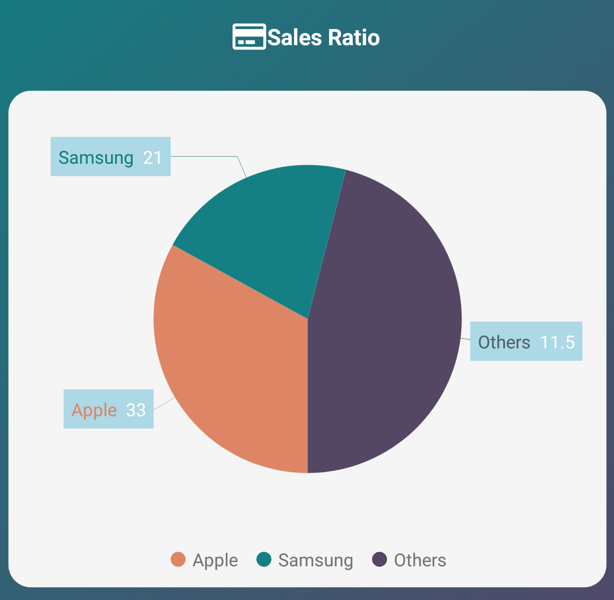

# How to bind the Xamarin.Forms pie chart DataMarker to “Others” category values

We always like to group smaller pie chart values into the category "Others" to increase chart readability. But we also think about ways to show those grouped values in UI. 

This article explains how to show grouped values of Xamarin.Forms Pie Chart using DataMarker Labels by these following ways, you can display the average of clustered values, either can display the individual value present in it.

## How to show the sum of values that grouped at Xamarin Pie Chart
The below code example shows how to calculate and display the average of grouped value using the DataMarker LabelTemplate.

 

Step 1: Declaration IValueConverter to calculate average values.
```
public class ChartAvgValueConverter : IValueConverter
{
    public object Convert(object value, Type targetType, object parameter, CultureInfo culture)
    {
        if (value != null)
        {
            //Return string value.
            if (parameter != null && parameter.ToString() == "Label")
            {
                return value is List<object> ? "Others" : (value as DataModel).XData;
            }
            else
            {
                //Return average value.
                if (value is List<object>)
                {
                    var collection = value as List<object>;
                    var sum = collection.Sum(item => (item as DataModel).YData);
                    return sum / collection.Count;
                }
                else
                {
                    return (value as DataModel).YData;
                }
            }
        }
     
        return null;
    }

    public object ConvertBack(object value, Type targetType, object parameter, CultureInfo culture)
    {
        return value;
    }
}
```

Step 2: DataTemplate declarations.
```
<ContentView.Resources>
    <local:ChartAvgValueConverter x:Key="sumOfValuesConverter"/>
<DataTemplate x:Key="dataMarkerTemplate">
        <StackLayout Orientation="Horizontal">
            <Label Text="{Binding Converter={StaticResource sumOfValuesConverter}, ConverterParameter='Label'}". . />
            <Label Text="{Binding Converter={StaticResource sumOfValuesConverter}}" ../>
        </StackLayout>
    </DataTemplate>
</ContentView.Resources>
```
Step 3: DataTemplate defined in the Series DataMarker LabelTemplate.
 ```
 <chart:SfChart BackgroundColor="Transparent">
. . .
    <chart:SfChart.Series>
        <chart:PieSeries 
            ItemsSource="{Binding MonthlyExpenses}" 
            XBindingPath="XData" 
            YBindingPath="YData" 
            GroupMode="Value"
            GroupTo="50"
            >
<chart:PieSeries.DataMarker>
    <chart:ChartDataMarker x:Name="dataMarker" LabelTemplate="{StaticResource dataMarkerTemplate}">
        
    </chart:ChartDataMarker>
</chart:PieSeries.DataMarker>
            
        </chart:PieSeries>
    </chart:SfChart.Series>
    </chart:SfChart>
```



## How to bind the Xamarin.Forms Pie Chart grouped data collection to the DataMarker Label

The below code example shows how to display the values, which present inside the group ‘Others’.
 
Step 1: Declaration IValueConverter to generate BindableLayout ItemsSource
```
public class ChartValueConverter : IValueConverter
{
//Which returns ItemsSource for bindable layout.
    public object Convert(object value, Type targetType, object parameter, CultureInfo culture)
    {

        if(value != null)
        {
            IList<DataModel> dataList = new List<DataModel>();
            if (value is DataModel)
            {
                dataList.Add(value as DataModel);
                return dataList;
            }
            else
            {
                return value;
            }
        }

        return value;
    }

    public object ConvertBack(object value, Type targetType, object parameter, CultureInfo culture)
    {
        return value;
    }
}
```
Step 2: DataTemplate declarations with any of the BindableLayout.
```
<ContentView.Resources>
    <local:ChartValueConverter x:Key="itemsSourceConverter"/>
    <DataTemplate x:Key="dataMarkerTemplate">
        <StackLayout BindableLayout.ItemsSource="{Binding Converter={StaticResource itemsSourceConverter}}" >
            <BindableLayout.ItemTemplate>
                <DataTemplate>
                    <StackLayout Orientation="Horizontal" HorizontalOptions="FillAndExpand">
                        <Label Text="{Binding XData}" HorizontalTextAlignment="Center"/>
                        <Label Text="{Binding YData}" HorizontalTextAlignment="Center"/>
                    </StackLayout>
                </DataTemplate>
            </BindableLayout.ItemTemplate>
        </StackLayout>
    </DataTemplate>
</ContentView.Resources>
```
Step 3: DataTemplate defined in the Series DataMarker LabelTemplate.
```
<chart:SfChart BackgroundColor="Transparent">
. . .
    <chart:SfChart.Series>
        <chart:PieSeries . . .
            GroupMode="Value"
            GroupTo="50"
            >
<chart:PieSeries.DataMarker>
    <chart:ChartDataMarker x:Name="dataMarker” LabelTemplate="{StaticResource dataMarkerTemplate}">
        
    </chart:ChartDataMarker>
</chart:PieSeries.DataMarker>
. . .
        </chart:PieSeries>
    </chart:SfChart.Series>
</chart:SfChart>
```


